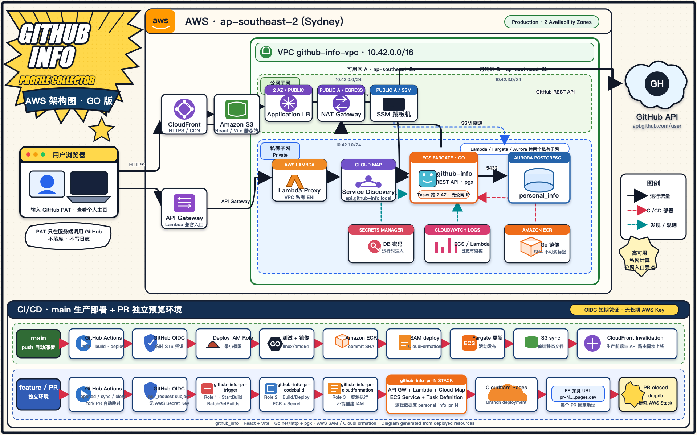
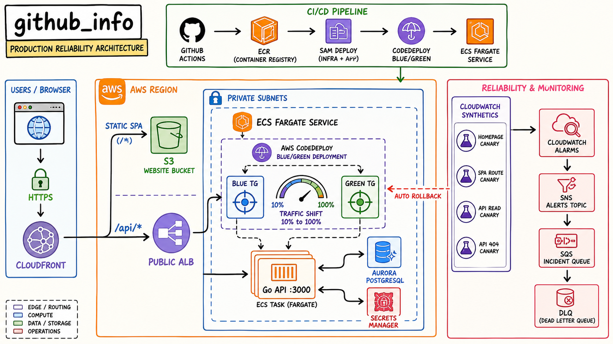

# github_info

## 这个项目的功能简述

这是一个用于获取并保存 GitHub 个人账户信息的全栈项目。用户在前端输入自己的 GitHub Personal Access Token 后，系统会调用 GitHub API 获取个人资料，并通过后端接口把账号信息保存到 PostgreSQL 数据库中；保存后可以用用户名生成一个个人介绍页面（`/intro/:login`）。

项目主要包含：

- 前端：React + TanStack Router + Vite
- 后端：**Go**（标准库 `net/http` + pgx），REST API；本地跑 HTTP server，云上以容器运行在 ECS Fargate，Lambda 保留为 API Gateway 兼容入口
- 数据库：PostgreSQL，**唯一数据库 `personal_info`**（表 `personal_profiles`），保存个人信息；本地默认的 `postgres` 库与早期的 `github_info` 库均已删除。库和表由 Go 服务启动时自动创建（缺库时经系统模板库 `template1` 引导 `CREATE DATABASE`，再 `CREATE TABLE IF NOT EXISTS`）
- 页面：首页（Token 获取/保存账户信息）+ 个人介绍页（按用户名从 `personal_info` 库读取并生成介绍）

> 历史说明：后端最初是 Node（Hono + tRPC + Drizzle + Neon），2026-07 全量替换为 Go；AWS SAM / GitHub Actions 部署配置也已同步迁移为 Go 版（见「云端部署」）。

## 架构是什么

前后端分离。本地：

- 浏览器访问前端页面（Vite dev server，:3001）
- 前端通过 REST 调用 Go 后端（:3000）
- Go 后端用 pgx 连接本地 PostgreSQL（:5432）的 `personal_info` 库
- 拉取 GitHub 资料时，由 Go 服务端调用 GitHub API（PAT 只在服务端使用，不落库、不写日志）；成功后个人信息写入 `personal_profiles`

## 后端 API

| 方法 | 路径 | 说明 |
| --- | --- | --- |
| GET | `/` | 健康检查，返回 `OK` |
| POST | `/api/github-account/fetch` | body `{"token": "..."}`，校验 PAT → 拉取 GitHub 用户 → 写入 `personal_profiles`，返回 `{account, saved}` |
| GET | `/api/intro/:login` | 按用户名（大小写不敏感）从 `personal_info` 读取个人信息，返回 `{account, updatedAt}` |

错误统一为 `{"error": {"code", "message"}}`，code 与旧 tRPC 版一致（`UNAUTHORIZED` / `FORBIDDEN` / `TOO_MANY_REQUESTS` / `NOT_FOUND` / `BAD_REQUEST` / `INTERNAL_SERVER_ERROR`）。

## 本地开发

前置条件：

- Go 1.26+
- 本地 PostgreSQL 运行中即可，**无需手工建库**（`personal_info` 库与表由 Go 服务首次启动时自动创建）：

```bash
brew services run postgresql@17   # 启动本地 PG（未设开机自启）
```

安装前端依赖：

```bash
pnpm install
```

启动（两个终端，或先后台跑 server）：

```bash
pnpm dev:server   # Go 后端 -> http://localhost:3000
pnpm dev:web      # 前端   -> http://localhost:3001
```

后端环境变量在 `apps/server/.env`（已 gitignore）：

```
DATABASE_URL=postgres://Admin@localhost:5432/personal_info
CORS_ORIGIN=http://localhost:3001
PORT=3000
```

## 云端部署（ECR + ECS Fargate + ALB + Cloud Map）





- **部署引导**：`github-info-bootstrap` CloudFormation 栈先创建 ECR 与前端 S3 网站桶，随后主 SAM 栈构建并部署应用资源，支持从空 AWS 环境恢复。
- **前端**：S3 托管静态文件，CloudFront 提供 HTTPS。普通页面请求进入 S3，`/api/*` 通过独立 Cache Behavior 转发到 ALB。
- **容器镜像**：GitHub Actions 使用提交 SHA 构建 `linux/amd64` Go 镜像并推送到私有 ECR；仓库开启不可变标签、推送扫描和生命周期清理。
- **后端**：公网 ALB 位于两个公网子网；ECS Fargate 服务位于两个私有子网，不分配公网 IP。ALB 仅把流量转发到 ECS 安全组的 `3000` 端口。
- **Lambda 兼容入口**：API Gateway + Lambda 继续保留；Lambda 不再直接连接数据库，而是通过私有 Cloud Map 地址 `api.github-info.local:3000` 代理到 ECS。
- **数据库**：Aurora PostgreSQL 位于私有子网，只允许 ECS、Lambda 和 SSM 跳板机安全组访问 `5432`。应用只使用 `personal_info`，缺库时由 Fargate 服务经 `template1` 自动创建。
- **凭证与日志**：数据库密码存入 Secrets Manager，并在运行时注入 ECS Task；Task Execution Role 只负责拉取 ECR、读取该 Secret 和写入 `/ecs/github-info-server` 日志组。
- **VPC**：两个公网子网承载 ALB，其中一个保留 NAT Gateway 和 SSM 跳板机；两个私有子网承载 Fargate、Lambda 和 Aurora。Fargate 通过 NAT 调用 GitHub API。
- **CI/CD**：push `main` 后自动测试，构建并推送镜像，再由 SAM/CloudFormation 更新基础设施和 ECS Task Definition，最后构建前端、同步 S3 并刷新 CloudFront。

### PR 独立预览环境

同仓库 PR 可通过 GitHub OIDC 启动 AWS CodeBuild。每个 PR 使用独立的 ECS Service、Cloud Map 服务、Lambda/API Gateway、Aurora 逻辑数据库和 Cloudflare Pages 分支地址，同时复用现有 VPC、NAT、ECR、ECS Cluster 与 Aurora 集群。PR 关闭后自动清理 AWS Stack 和对应数据库。

完整配置和运维步骤见 [`docs/pr-preview-environments.md`](docs/pr-preview-environments.md)。

## 常用命令

```bash
pnpm run build        # 全部构建（server 走 go build，web 走 vite）
pnpm run check-types  # web/ui 跑 tsc，server 跑 go vet
pnpm run check        # biome 全仓 lint + 格式化
cd apps/server && go test ./...   # Go 测试（含数据库往返测试，PG 不可达时自动跳过）
```

## 项目结构

```text
github_info/
├── apps/
│   ├── web/         # 前端应用（React + TanStack Router）
│   │   └── src/
│   │       ├── lib/api.ts          # REST 客户端（类型 + 错误映射）
│   │       └── routes/
│   │           ├── index.tsx       # 首页：Token 获取账户信息
│   │           └── intro.$login.tsx # 个人介绍页（新功能）
│   └── server/      # Go 后端
│       ├── main.go      # 入口：Fargate/本地 HTTP 服务与 Lambda 兼容模式
│       ├── proxy.go     # Lambda 经 Cloud Map 代理到 ECS Fargate
│       ├── github.go    # GitHub API 客户端（错误分类，token 不进日志/错误信息）
│       ├── profiles.go  # personal_info 库：自动建库（template1 引导）、personal_profiles 读写
│       ├── handlers.go  # HTTP handler 与错误响应
│       ├── Makefile     # sam build 用的 Go 交叉编译目标（bootstrap）
│       └── profiles_test.go # 数据库往返 + 自动建库引导测试
├── packages/
│   ├── ui/          # 共享 UI 组件（shadcn）
│   ├── env/         # 前端环境变量校验（VITE_SERVER_URL）
│   └── config/      # 共享 tsconfig
├── infra/
│   └── production-bootstrap.yaml # 首次部署所需的 ECR 与前端 S3
├── template.yaml    # AWS SAM/CloudFormation：ECS/Fargate + ALB + Cloud Map + Lambda + VPC + Aurora
└── docs/            # 产品 PRD
```
